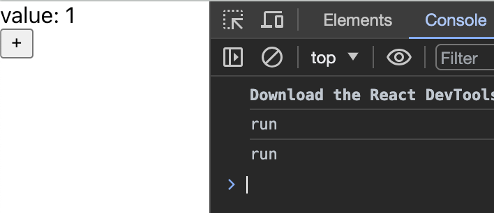

## 在 React strict mode 時，useReducer 的 action 被觸發了兩次

### 在 React 裡實作跨元件狀態管理時，發現 reducer 裡的動作做了兩次，意思是存在 context 裡面的 state 可能會出現非預期的狀況。

### Source code
1. index.js
```javascript
import { StrictMode } from "react";
import { createRoot } from "react-dom/client";

import { App, App2 } from "./App";

const rootElement = document.getElementById("root");
const root = createRoot(rootElement);

root.render(
  <StrictMode>
    <App />
  </StrictMode>
);
```

2. App.js
```javascript
import { createContext, useReducer, useContext, StrictMode } from "react";

const ReducerContext = createContext(null);

function actions(state, action) {
  switch (action.type) {
    case "increase": {
      state += 1;
      console.log('run');
      debugger;
      return state;
    }
    default: {
      throw Error("Unknown action: " + action.type);
    }
  }
}

export function App() {
  const [ state, dispatch ] = useReducer(actions, 0);
  return (
    <div className="App">
      <ReducerContext.Provider value={{ state, dispatch }}>
        <Example />
      </ReducerContext.Provider>
    </div>
  );
}

const Example = () => {
  const { state, dispatch } = useContext(ReducerContext);
  return (
    <div>
      value: {state}
      <button onClick={() => dispatch({ type: "increase" })}>+</button>
    </div>
  );
};
```

### 說明
App.js 基本上是按照官方的文件來實作 `context + reducer` 的跨元件狀態管理：[Scaling Up with Reducer and Context](https://react.dev/learn/scaling-up-with-reducer-and-context)  
在這裡定義了 `context` 與 `reducer` 並且把 `dispatch` 與 `state` 存在 `Context.Provider`，如此一來在其他元間裡面用 `uesContext` 就可以透過更新狀態了。  
這邊定義了一個動作 `increase`，點擊按鈕之後會讓 `state` 值 +1。  
實際上在運作時，`debugger` 被執行了 2 次，也印出了 2 次 "run"。


### 解決方式：
1. 把 `<StrictMode>` 拿掉簡單粗暴，問題就解決了。
2. 把 `Context.Provider` 放到 `<StrictMode>` 外面，也可以解決。

```Javascript
// index.js
// 加了嚴格模式會跑 2 次
root.render(
  <StrictMode>
    <App />
  </StrictMode>
);

// 不加嚴格模式只跑 1 次
root.render(
  <App />
);

// 嚴格模式放在 provider 裡面，只跑 1 次，參考下方 App2
root.render(
  <App2 />
);

------
// App.js
export function App() {
  const [ state, dispatch ] = useReducer(actions, 0);
  return (
    <div className="App">
      <ReducerContext.Provider value={{ state, dispatch }}>
        <Example />
      </ReducerContext.Provider>
    </div>
  );
}

export function App2() {
  const [ state, dispatch ] = useReducer(actions, 0);
  return (
    <div className="App">
      <ReducerContext.Provider value={{ state, dispatch }}>
        {/* 放在裡面 */}
        <StrictMode>
          <Example />
        </StrictMode>
      </ReducerContext.Provider>
    </div>
  );
}

```

### Reference
[https://github.com/facebook/react/issues/16295](https://github.com/facebook/react/issues/16295)